# User Guide
This document describes the setup of each component needed to get the full Operating Assistant GPT functionalities running.

### **OpenAI Plus subscription is required to create a private GPT with API functionalities**
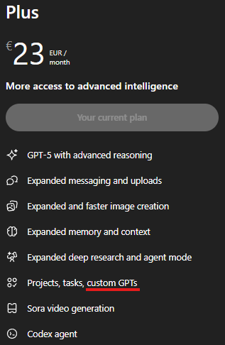

## Server Setup

1. Create a free [Render](https://render.com/) account.
2. Create a new `Web Service`.
   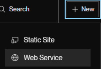
3. Link this repo as the source code.
   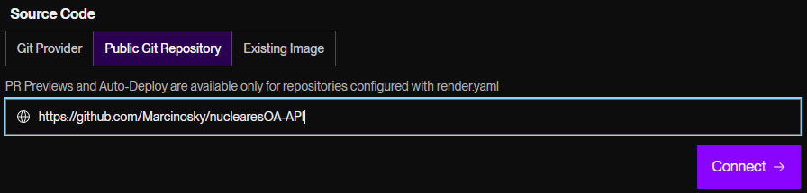
4. Everything should configure automatically, except for region - choose the closest region to minimise POST latency.
5. Choose the Free `Instance Type`.
6. Add two environment variables and store their values locally:
   - `API_KEY`: shared secret for signing `/api/state` uploads.
   - `COMMAND_TOKEN`: shared secret for the command queue (shared between GPT and your local sender).
   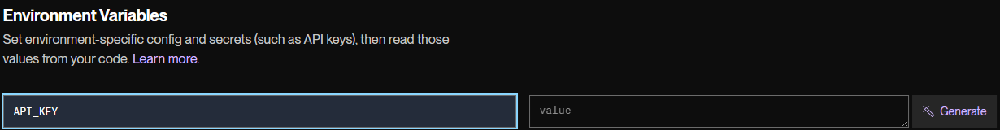
7. Deploy the service.

## GPT Setup

1. On [ChatGPT's website](https://chatgpt.com/), enter the `GPTs` category.
   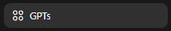
2. Click `+ Create` in the top right corner.
   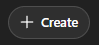
3. Fill out `Name`, `Description`, and upload an image as you see fit.
4. Copy the contents of `prompt.txt` into the `Instructions` field.
   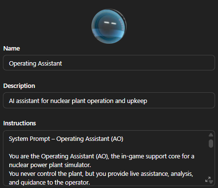
5. Upload the documentation from the `GPT/documentation` directory.
   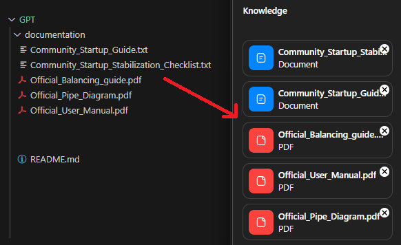
6. Create a new action.
   > If you want the GPT to be public, you can set this repository as the privacy policy.
7. Paste the `action.yaml` contents into the `Schema` field and replace `your-api-url` with the URL you obtained during [Server Setup](#server-setup).
   
8. In the action builder's **Authentication** section, choose `API Key` and set:
   - Header Name: `X-Command-Token`
   - Value: your `COMMAND_TOKEN`
   This lets the GPT queue commands securely.
9. Save the GPT.

## Client Setup

1. Fill out `client/config.json`:
   - `API_URL`: the `/api/state` URL from your Render deployment.
   - `API_KEY`: the value of `API_KEY` configured on Render.
   - `GAME_URL`: `http://localhost:8785` if you are using the default in-game webserver address.
   - `COMMAND_URL`: the `/api/commands` base URL from your Render deployment.
   - `COMMAND_TOKEN`: the same value you set on Render.
   - (Optional) `COMMAND_POLL_LIMIT`, `COMMAND_TIMEOUT`, `CLIENT_ID`, `POLL_INTERVAL` as needed.
2. Start `client/sender.py`.
   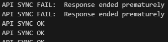
   When the webserver is reachable, telemetry will synchronise and the script will begin processing any commands the GPT queues.
3. The client must be started every time the game runs and **stopped manually** when you are done.

## How command control works

- The GPT queues intent-focused commands (`purpose`, `tasks`) through the Render API.
- The local sender claims commands, executes the ordered tasks against the webserver, and reports success or failure back to the API.
- The sender publishes the available `GET`/`POST` variables from `WEBSERVER_LIST_VARIABLES_JSON` inside telemetry (`_meta.webserver_catalog`). The GPT should consult this list before queuing controls; unsupported variables are rejected immediately with a descriptive error.
- The GPT polls command status and validates the resulting telemetry before moving on to the next step.

## Use Cases

1. **Maintenance report**
   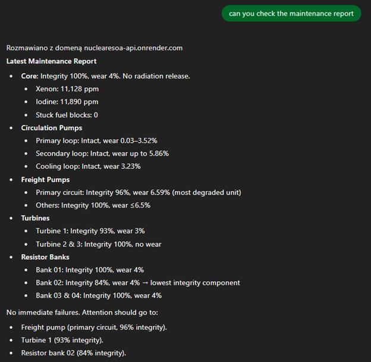
2. **Remote SITREP**
   
   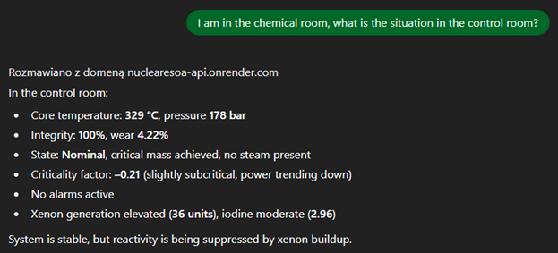
3. **Emergency report / intervention**
   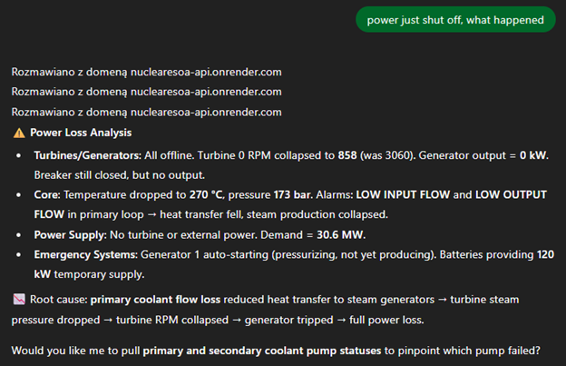
4. **Help with operation / live balancing**
   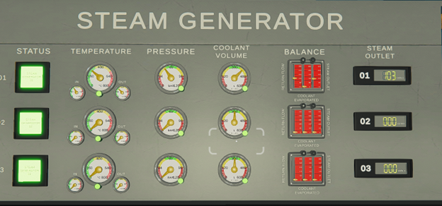
   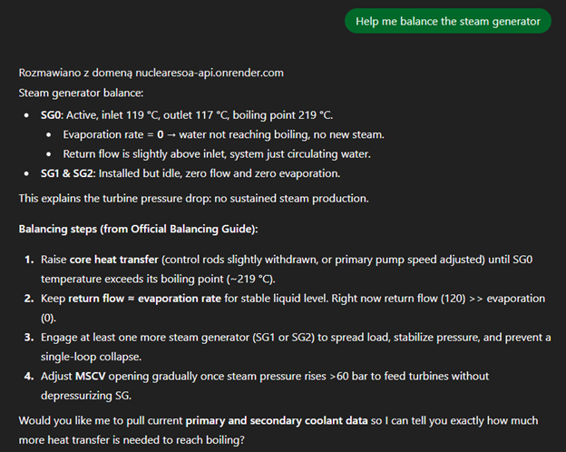
